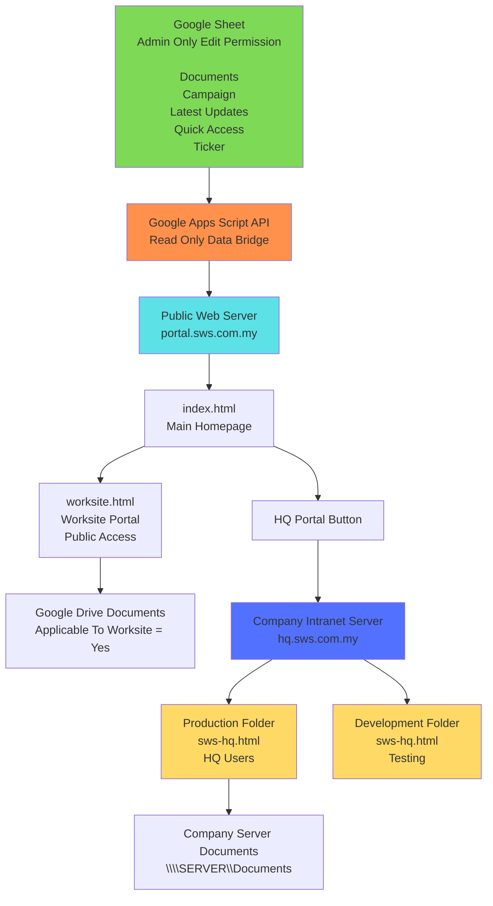

# SWS Document Portal

## System Architecture

## Access Control

| Portal | Access | Storage |
|---|---|---|
| Homepage | Public | Public Server |
| Worksite Portal | Public | Google Drive Documents |
| HQ Portal | Internal Only | Company Server |
